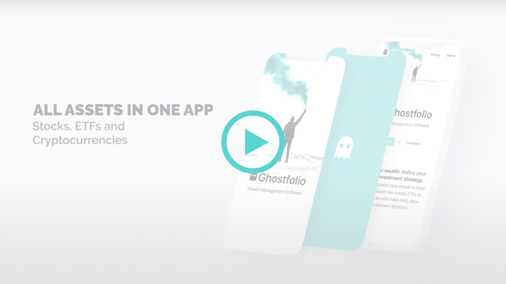
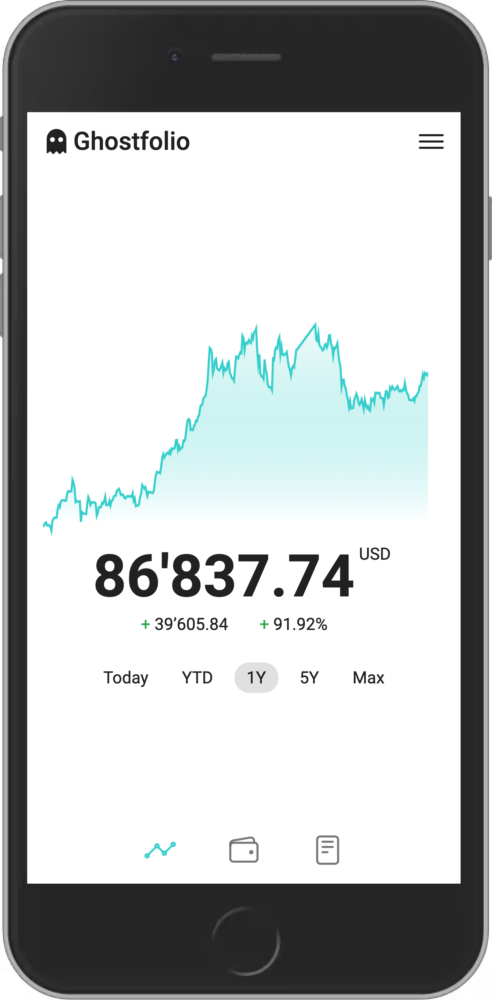

# STACKS

**Wealth Management Software**

[**Ghostfol.io**](https://ghostfol.io) | [**Live Demo**](https://ghostfol.io/en/demo) | [**Ghostfolio Premium**](https://ghostfol.io/en/pricing) | [**FAQ**](https://ghostfol.io/en/faq) |
[**Blog**](https://ghostfol.io/en/blog) | [**Slack**](https://join.slack.com/t/ghostfolio/shared_invite/zt-vsaan64h-F_I0fEo5M0P88lP9ibCxFg) | [**X**](https://twitter.com/ghostfolio_)

**Ghostfolio** is an open source wealth management software built with web technology. The application empowers busy people to keep track of stocks, ETFs or cryptocurrencies and make solid, data-driven investment decisions. The software is designed for personal use in continuous operation.

## Ghostfolio Premium

Our official **[Ghostfolio Premium](https://ghostfol.io/en/pricing)** cloud offering is the easiest way to get started. Due to the time it saves, this will be the best option for most people. Revenue is used to cover the costs of the hosting infrastructure and to fund ongoing development.

If you prefer to run Ghostfolio on your own infrastructure, please find further instructions in the [Self-hosting](#self-hosting) section.

## Why Ghostfolio?

Ghostfolio is for you if you are...

- 💼 trading stocks, ETFs or cryptocurrencies on multiple platforms
- 🏦 pursuing a buy & hold strategy
- 🎯 interested in getting insights of your portfolio composition
- 👻 valuing privacy and data ownership
- 🧘 into minimalism
- 🧺 caring about diversifying your financial resources
- 🆓 interested in financial independence
- 🙅 saying no to spreadsheets
- 😎 still reading this list

## Features

- ✅ Create, update and delete transactions
- ✅ Multi account management
- ✅ Portfolio performance: Time-weighted rate of return (TWR) for `Today`, `YTD`, `1Y`, `5Y`, `Max`
- ✅ Various charts
- ✅ Static analysis to identify potential risks in your portfolio
- ✅ Import and export transactions
- ✅ Dark Mode
- ✅ Zen Mode
- ✅ Progressive Web App (PWA) with a mobile-first design

## Technology Stack

Ghostfolio is a modern web application written in [TypeScript](https://www.typescriptlang.org) and organized as an [Nx](https://nx.dev) workspace.

### Backend

The backend is based on [NestJS](https://nestjs.com) using [PostgreSQL](https://www.postgresql.org) as a database together with [Prisma](https://www.prisma.io) and [Redis](https://redis.io) for caching.

### Frontend

The frontend is built with [Angular](https://angular.io) and uses [Angular Material](https://material.angular.io) with utility classes from [Bootstrap](https://getbootstrap.com).

## Self-hosting

We provide official container images hosted on [Docker Hub](https://hub.docker.com/r/ghostfolio/ghostfolio) for `linux/amd64`, `linux/arm/v7` and `linux/arm64`.

